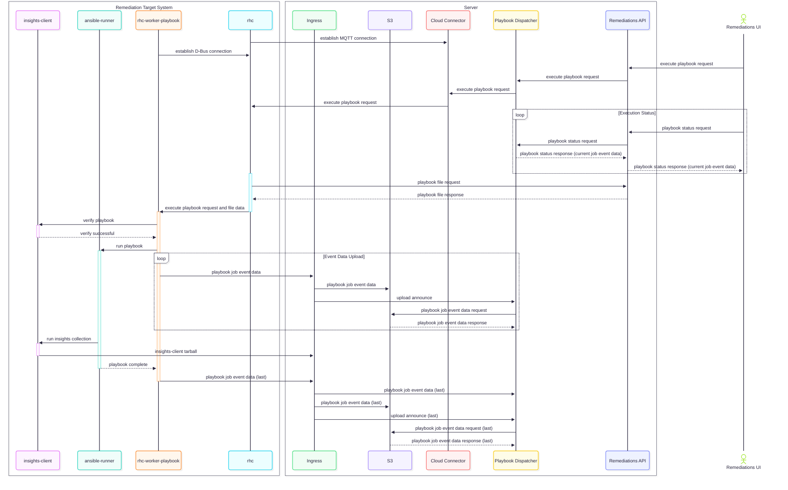

# End to End Remediations + RHC Interaction Flow 

```mermaid
---
config:
  look: neo
  theme: redux-color
---
sequenceDiagram
  box Remediation Target System
  %% participant ANSIBLE_
  participant ic as insights-client
  participant a as ansible-runner
  participant rwp as rhc-worker-playbook
  participant rhc as rhc
  end

  box Server
  participant i as Ingress
  participant s3 as S3
  %% participant sb as Storage Broker
  participant cc as Cloud Connector
  participant pbd as Playbook Dispatcher
  participant rm as Remediations API
  end

  %% box Web Client
  actor rui as Remediations UI
  %% end

  rhc ->> cc: establish MQTT connection
  rwp ->> rhc: establish D-Bus connection

  rui ->> rm: execute playbook request
  rm ->> pbd: execute playbook request
  pbd ->> cc: execute playbook request
  cc ->> rhc: execute playbook request

  loop Execution Status
    rui ->> rm: playbook status request
    rm ->> pbd: playbook status request
    pbd -->> rm: playbook status response (current job event data)
    rm -->> rui: playbook status response (current job event data)
  end
  %% Note right of rui: Ends after playbook completes
  activate rhc
    rhc ->> rm: playbook file request
    rm -->> rhc: playbook file response
    rhc ->> rwp: execute playbook request and file data
  deactivate rhc

  activate rwp
    rwp ->> ic: verify playbook
    activate ic
      ic -->> rwp: verify successful
    deactivate ic

    rwp ->> a: run playbook

    activate a
      %% rwp ->> i: playbook job event data (first)
      %% i ->> pbd: playbook job event data (first)
      loop Event Data Upload
      rwp ->> i: playbook job event data

      i ->> s3: playbook job event data

      i ->> pbd: upload announce

      pbd ->> s3: playbook job event data request
      s3 -->> pbd: playbook job event data response

      %% i ->> pbd: playbook job event data
      end
      %% rwp ->> i: playbook job event data
      %% i ->> pbd: playbook job event data
      %% rwp ->> i: playbook job event data
      %% i ->> pbd: playbook job event data

      a ->> ic: run insights collection

      activate ic
        ic ->> i: insights-client tarball
      deactivate ic

      a -->> rwp: playbook complete
    deactivate a

    rwp ->> i: playbook job event data (last)
  deactivate rwp
  i ->> pbd: playbook job event data (last)
  i ->> s3: playbook job event data (last)

  i ->> pbd: upload announce (last)

  pbd ->> s3: playbook job event data request (last)
  s3 -->> pbd: playbook job event data response (last)
  

```
