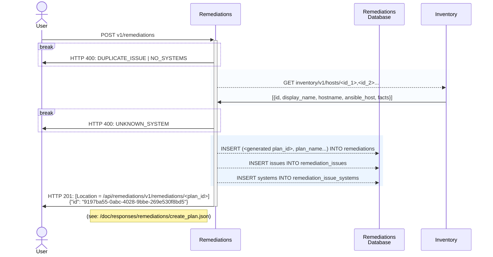

### POST v1/remediations

#### Procedure
1. Validate input
   1. Each issue has at least 1 system
   2. No duplication of issues
   3. Systems exist
      1. Fetch systems from Inventory
2. Update db
   1. Create new plan (generate id)
   2. Update existing issues (doesn't apply to new plans)
   3. Add new issues
   4. Add systems
3. Return new plan id

#### Sequence Diagram

