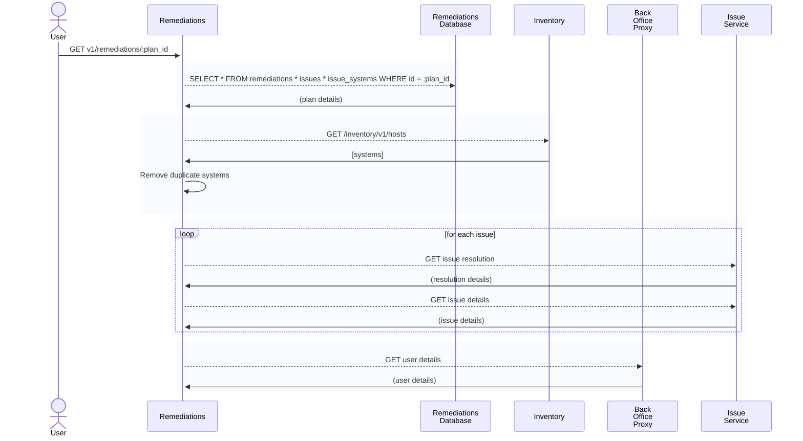

### GET v1/remediations/:plan_id

#### Procedure
1. Fetch plan from db
2. Get systems from inventory
   1. Remove systems not in inventory
3. Get resolution for each issue
4. Get details for each issue
5. Get user details from BOP
6. Remove issues with 0 systems or missing details
7. Infer needs_reboot
8. Return formatted result

#### Sequence Diagram
