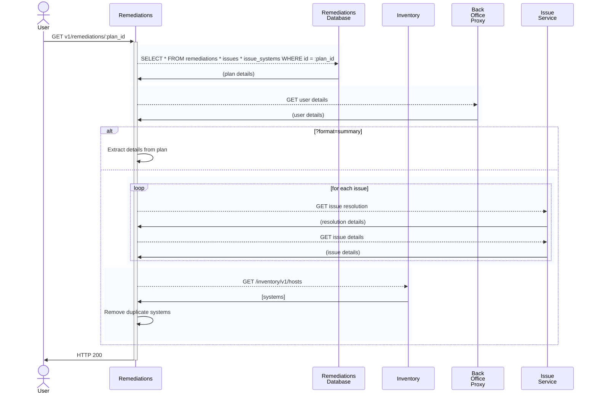

### GET v1/remediations/:plan_id

#### Procedure
1. Fetch plan from db
2. Get user details from BOP
4. `if ?format=summary`
   1. Extract details from plan
3. `else`
   1. Get systems from inventory
      1. Remove systems not in inventory
   2. Get resolution for each issue
   3. Get details for each issue
   4. Remove issues with 0 systems or missing details
   5. Infer needs_reboot
4. Return formatted result

#### Sequence Diagram
