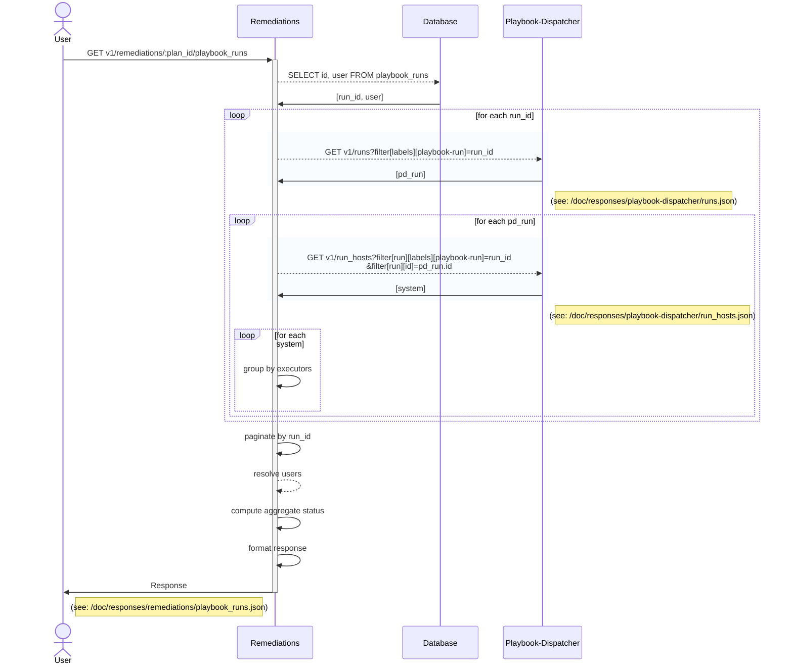

### GET v1/remediations/:plan_id/playbook_runs
#### Procedure
1. Fetch (run_ids, users) for plan_id from db
2. For each run_id:
   1. (paginated) GET /playbook-dispatcher/v1/runs?[labels][playbook-run]=run_id
   2. for each pd_run:
      1. (paginated) GET /playbook-dispatcher/v1/run_hosts?[labels][playbook-run]=run_id
      2. For each system: 
         1. Group by executor
6. Paginate by run_id
7. Resolve user info
8. Compute aggregate status
9. Format response
10. Return 

#### Sequence Diagram

