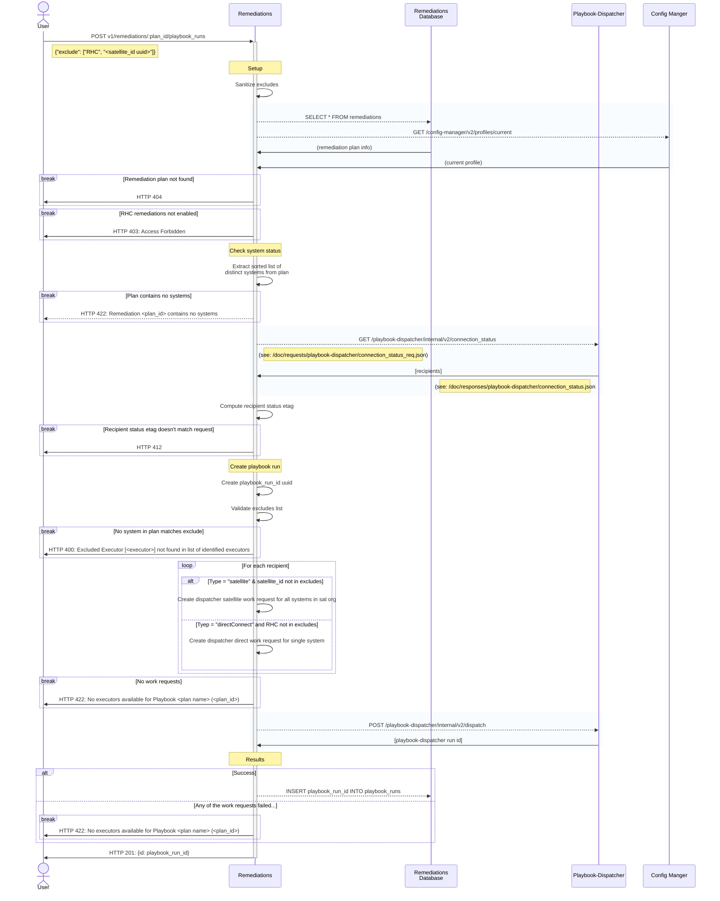

### POST v1/remediations/:plan_id/playbook_runs
#### Procedure
1. Setup
   1. Sanitize `excludes` - RHC or satellite_id
   2. Fetch remediation
      1. Return 404 if not found
   3. Fetch RHC enabled status: GET /config-manager/v2/profiles/current
      1. Return 403 if not enabled
2. Check system status
   1. Calculate sorted list of distinct systems
      1. Return 422 if no systems
   2. Get recipient list: GET /playbook-dispatcher/internal/v2/connection_status
   3. Compute recipient status etag etag
      1. Return 412 if recipient status etag doesn't match request
3. Create playbook run
   1. Create playbook_run_id
   2. validate `excludes` list
      1. Return 400 if any item in `excludes` not present in remediation plan
   3. Create dispatcher work requests
      1. For each recipient:
         1. if satellite recipient: 
            1. if satellite_id is not in `excludes`
               1. create satellite work request, with all systems in this sat organization
         2. if direct recipient:
            1. if 'RHC' is not in `excludes`
               1. create direct work request, with just this one system
   4. return 422 if no work requests
   5. POST /playbook-dispatcher/internal/v2/dispatch
      1. calculate aggregate status: no partial success!
4. Results
   1. If all work requests successful
      1. Store playbook_run_id in database
   2. If any work request failed
      1. Return 422
   3. Return 201({id: <playbook_run_id>})

#### Sequence Diagram

