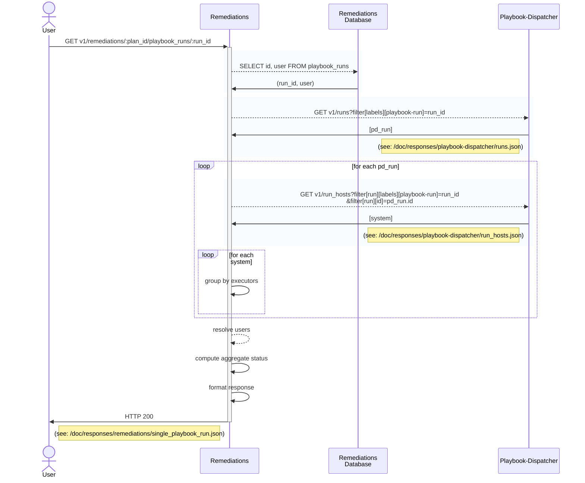

### GET v1/remediations/:plan_id/playbook_runs/:run_id
#### Procedure
1. Fetch (run_id, user) for run_id of plan_id from db
2. GET /playbook-dispatcher/v1/runs?[labels][playbook-run]=run_id
3. for each pd_run:
    1. (paginated) GET /playbook-dispatcher/v1/run_hosts?[labels][playbook-run]=run_id&filter[run][id]=pd_run.id
    2. For each system:
        1. Group by executor
4. Resolve user info
5. Compute aggregate status
6. Format response
7. Return

#### Sequence Diagram

