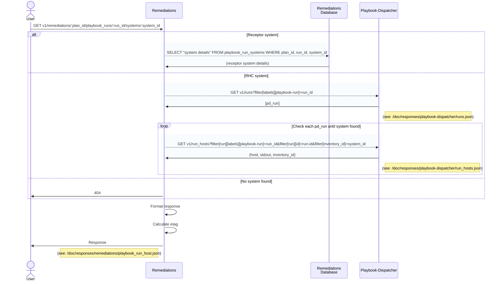

### GET v1/remediations/:plan_id/playbook_runs/:run_id/systems/:system_id?executor=executor_id&ansible_host=ansible_hostname

#### Procedure
1. system = fetch details FROM playbook_run_systems WHERE plan_id, run_id, system_id
2. else dispatcher_runs = GET /playbook-dispatcher/v1/runs?filter[labels][playbook-run]=run_id
   1. for run of dispatcher_runs
      1. run_host = GET /playbook-dispatcher/v1/run_hosts?filter[run][labels][playbook-run]=run_id&filter[run][id]=run.id&filter[inventory_id]=system_id (host, stdout, inventory_id)
      2. if run_host
         1. system = format host details
3. else 404
4. format system details
5. set etag
6. return

#### Sequence Diagram

