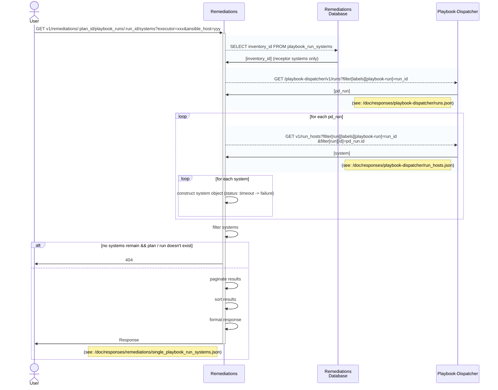

### GET v1/remediations/:plan_id/playbook_runs/:run_id/systems?executor=executor_id&ansible_host=ansible_hostname
#### Procedure
1. Fetch [receptor system] for run_id of plan_id from db, filter by executor_id, ansible_host
2. dispatcher_runs = GET /playbook-dispatcher/v1/runs?filter[labels][playbook-run]=run_id
3. If not filtering by receptor executor (i.e. always, since receptor has been retired):
   1. for each run in dispatcher_runs:
      1. GET [host, status, inventory_id]
         1. GET /playbook-dispatcher/v1/run_hosts?filter[run][labels][playbook-run]=run_id&filter[run][id]=run.id
            1. timeout -> failure 
         2. construct system object for each host {system_id, system_name, *status*, updated_at, executor_id}
   2. remove filtered hosts
4. If no systems remain, check to see if plan/run exist and return 404 if not
5. Paginate results
6. Sort systems (???)
7. Format result
8. Return

#### Sequence Diagram

